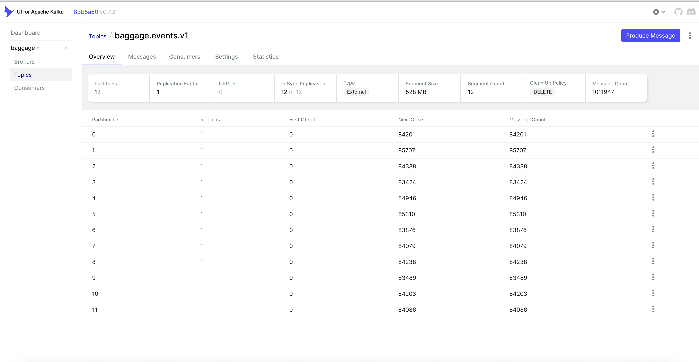

# Streaming Data to Track Flight Bags – Tutorial Repo

End-to-end, runnable demo of a baggage-tracking pipeline on Kubernetes using **Kafka → Flink → ClickHouse → Grafana** with a synthetic event generator. Use this as a hands-on tutorial to learn streaming ETL, stateful processing, and dashboarding.

```
Kafka (events, latest, alerts)
    ↑            |
Producer → baggage.events.v1
                 ↓
           Flink jobs
   BagLatest   FlightKPI   ItineraryStatus
        ↓            ↓            ↓
             ClickHouse (bag_events, bag_latest, itinerary_status, flight_kpis)
                                ↓
                           Grafana UI
```

## What’s inside
- **Flink jobs** (`flink-jobs/`): bag_latest, flight_kpi_alerts, itinerary_status.
- **Data gen** (`src/producer`): mock baggage events and flight schedules.
- **Infra manifests** (`k8s/`): Kafka+UI, ClickHouse (+init schema), Flink cluster, producer, Grafana datasources/dashboards/alerts.
- **Dashboards** (`k8s/grafana/dashboards/`):
  - Flight Bag Status
  - Passenger Bag Status
  - Fleet Flight Bag Coverage
  - Bag Detail
  - Itinerary Exceptions

## Prerequisites
- Docker (or another OCI builder)
- kubectl + a local K8s (kind/minikube/Docker Desktop)
- Helm (for Grafana if you prefer chart install)
- (Optional) kind: `kind create cluster --name baggage`

## Quickstart (local cluster)
1) **Namespace**
```bash
kubectl apply -f k8s/namespaces.yaml
```

2) **Build images**
```bash
./scripts/build-flink-image.sh                        # builds baggage-flink:local
docker build -t baggage-producer:local -f docker/producer/Dockerfile .
```
If using kind:
```bash
kind load docker-image baggage-flink:local --name baggage
kind load docker-image baggage-producer:local --name baggage
```

3) **Kafka + UI**
```bash
kubectl apply -f k8s/kafka/cp-kafka.yaml
kubectl apply -f k8s/kafka/kafka-ui.yaml
```

4) **ClickHouse + schema**
```bash
kubectl apply -f k8s/clickhouse/clickhouse.yaml
kubectl apply -f k8s/clickhouse-init/init-job.yaml
```

5) **Flink cluster + jobs**
```bash
kubectl apply -f k8s/flink/jobmanager.yaml
kubectl apply -f k8s/flink/taskmanager.yaml
kubectl apply -f k8s/flink/job-submit.yaml   # submits all PyFlink jobs
```

6) **Event producer**
```bash
kubectl apply -f k8s/producer/configmap.yaml
kubectl apply -f k8s/producer/deployment.yaml
```

7) **Grafana**
- If you use Helm:
```bash
helm repo add grafana https://grafana.github.io/helm-charts
helm upgrade --install grafana grafana/grafana -n baggage-poc -f k8s/grafana-values.yaml
```
- Load datasource/dashboards/alerts:
```bash
kubectl apply -f k8s/grafana/datasources.yaml
kubectl apply -f k8s/grafana/alerts/alert-rules.yaml
kubectl -n baggage-poc create configmap grafana-dashboards \
  --from-file=k8s/grafana/dashboards --dry-run=client -o yaml | kubectl apply -f -
```

## Access the UIs (port-forward)
- Grafana (admin / admin123):
  ```bash
  kubectl -n baggage-poc port-forward svc/grafana 3000:80
  ```
- Kafka UI:
  ```bash
  kubectl -n baggage-poc port-forward svc/kafka-ui 8080:8080
  ```
- Flink Dashboard:
  ```bash
  kubectl -n baggage-poc port-forward svc/flink-jobmanager 8081:8081
  ```
- ClickHouse client (example):
  ```bash
  kubectl -n baggage-poc exec -it deploy/clickhouse -- clickhouse-client
  ```

## Dashboards to try (Grafana)
- **Flight Bag Status**: per-flight stage mix, KPIs, latest bags, events/min.
- **Passenger Bag Status**: pick a `customer_id`, see their bag stages, itineraries, events/min.
- **Fleet Flight Bag Coverage**: three lists (pre-departure, in-flight, arrived) with % loaded / carousel plus headline stats.
- **Bag Detail**: bag history and itinerary status.
- **Itinerary Exceptions**: itineraries in at-risk/delayed/exception states.

## Data model (ClickHouse)
- `baggage.bag_events` — raw events (bag_id, itinerary_id, customer_id, flight_id, event_type, event_time, attributes…)
- `baggage.bag_latest` — last state per bag (now includes customer_id, leg_index)
- `baggage.itinerary_status` — journey state per itinerary
- `baggage.flight_kpis` — flight-level KPIs (populated by flight_kpi_alert job)
- `baggage.alerts` / `baggage.notifications` — derived alerts/notifications

## Rebuilding jobs after code changes
```bash
./scripts/build-flink-image.sh
kind load docker-image baggage-flink:local --name baggage   # if using kind
kubectl -n baggage-poc delete job flink-job-submit --ignore-not-found=true
kubectl -n baggage-poc apply -f k8s/flink/job-submit.yaml   # resubmit jobs
```

## Troubleshooting
- **No data in dashboards**: ensure producer pod is running; check Kafka UI for `baggage.events.v1`.
- **bag_events timeseries empty**: widen Grafana panel time window (set `timeFrom` or use a more recent flight_id).
- **ClickHouse schema drift**: rerun `k8s/clickhouse-init/init-job.yaml` or recreate Kafka MV tables (see file).
- **Images not found**: load `baggage-flink:local` and `baggage-producer:local` into your cluster runtime (kind/minikube).

## Nice-to-have screenshots
- Kafka UI topic messages (baggage.events.v1)
- Docker Desktop/K8s pods healthy
- Grafana dashboards (Flight Bag Status, Passenger Bag Status, Fleet Coverage)

## Screenshots (drop your PNGs here)
Place screenshots in `docs/screenshots/` and Git will pick them up. Suggested file names:
- `docs/screenshots/kafka-ui-topic.png` – topic overview (baggage.events.v1)
- `docs/screenshots/kafka-ui-message.png` – single message with customer_id shown
- `docs/screenshots/grafana-fleet.png` – Fleet Flight Bag Coverage
- `docs/screenshots/grafana-passenger.png` – Passenger Bag Status
- `docs/screenshots/grafana-bag-detail.png` – Bag Detail
- `docs/screenshots/grafana-flight.png` – Flight Bag Status

Reference them with markdown like:
```markdown

```

Enjoy hacking on streaming data! Contributions and PRs welcome.
